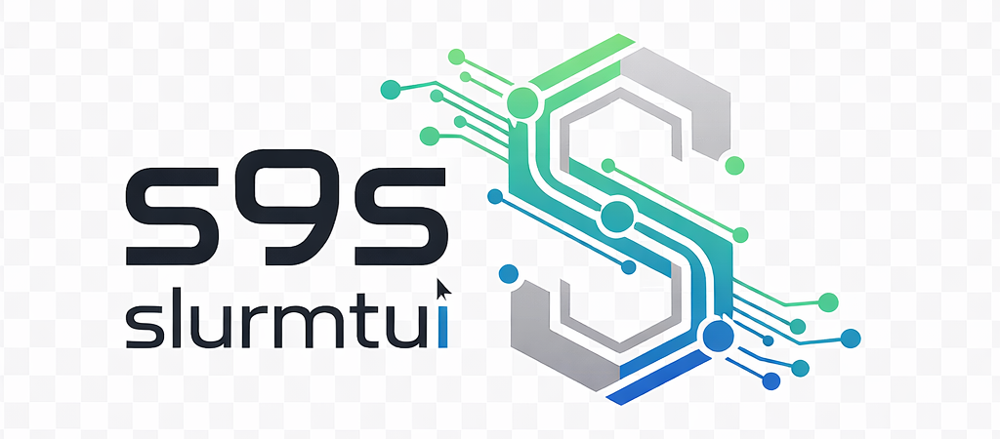

# s9s - Terminal UI for SLURM

<p align="center">
  <a href="https://s9s.dev">
    <picture>
      <source media="(prefers-color-scheme: dark)" srcset="docs/assets/s9s_logo_dark.png">
      <source media="(prefers-color-scheme: light)" srcset="docs/assets/s9s_logo_light.png">
      
    </picture>
  </a>
</p>

<p align="center">
  <a href="https://github.com/jontk/s9s/releases/latest"></a>
  <a href="https://github.com/jontk/s9s/actions/workflows/ci.yml"></a>
  <a href="https://codecov.io/gh/jontk/s9s"></a>
  <a href="https://goreportcard.com/report/github.com/jontk/s9s"></a>
  <a href="https://pkg.go.dev/github.com/jontk/s9s"></a>
  <a href="https://opensource.org/licenses/MIT"></a>
  <a href="https://s9s.dev"></a>
</p>

s9s provides a terminal interface for managing SLURM clusters, inspired by the popular [k9s](https://k9scli.io/) Kubernetes CLI. It allows HPC administrators and users to monitor and manage jobs, nodes, and cluster resources efficiently from the terminal.

## 🎬 Demo

<p align="center">
  
</p>

## 📚 Documentation

- **User Documentation**: [https://s9s.dev/docs](https://s9s.dev/docs)
- **Getting Started**: [docs/getting-started/](docs/getting-started/)
- **User Guide**: [docs/user-guide/](docs/user-guide/)
- **Development**: [docs/development/](docs/development/)
- **Plugins**: [docs/plugins/](docs/plugins/)

## ✨ Features

- **10 Dedicated Views**: Jobs, Nodes, Partitions, Reservations, QoS, Accounts, Users, Dashboard, Health, Performance
- **Job Management**: Submit, cancel, hold, release, requeue, and monitor jobs with rich detail modal (TRES/GRES, batch host, submit command)
- **Real-time Job Output Streaming**: Live `tail -f` style output viewer with stdout/stderr switching and export
- **Batch Operations**: Perform actions on multiple jobs simultaneously with multi-select mode
- **Advanced Filtering**: `/` for quick filter, `f` for advanced filter, `Ctrl+F` for cross-view search
- **Command Mode**: Vim-style `:` commands with Tab completion (press Tab on empty prompt to browse all commands)
- **Dashboard Layouts**: Switch between default 6-panel view and monitoring layout with `L`
- **Contextual Help**: Press `?` for view-specific keyboard shortcuts
- **SSH Integration**: Connect directly to compute nodes from the Nodes view
- **Export**: CSV, JSON, Markdown, HTML, and Text export in all data views
- **Health Monitoring**: Automated cluster health checks with alerts and scoring
- **Cluster Performance**: Real-time cluster-wide CPU, memory, and job metrics
- **Configuration**: In-app settings (F10) with live config editing and save
- **Multi-Cluster**: Switch between clusters with `Ctrl+K`
- **Self-Update**: `s9s update` to check and install new versions
- **Mock Mode**: Built-in SLURM simulator for development and testing

## 🚀 Quick Start

### Prerequisites

- Go 1.25 or higher
- Access to a SLURM cluster (or use mock mode)
- Terminal with 256 color support

### Installation

#### Quick Install (Recommended)

```bash
curl -sSL https://get.s9s.dev | bash
```

#### Using Go Install

```bash
go install github.com/jontk/s9s/cmd/s9s@latest
```

#### From Source

```bash
git clone https://github.com/jontk/s9s.git
cd s9s
make build
mkdir -p ~/.local/bin
mv build/s9s ~/.local/bin/
```

> **Note:** `go build -o s9s cmd/s9s/main.go` works but will not embed version info. Use `make build` to include version, commit, and build date via `-ldflags`.

### Basic Usage

```bash
# Connect to your SLURM cluster
s9s

# Use mock mode for testing (requires S9S_ENABLE_MOCK env var)
S9S_ENABLE_MOCK=1 s9s --mock

# Connect to a specific cluster
s9s --cluster production

# Use a specific config file
s9s --config /path/to/config.yaml

# Enable debug logging
s9s --debug
```

### Configuration

#### Zero-Configuration (Recommended)

On any SLURM node, s9s works out of the box — no configuration needed. It auto-discovers the slurmrestd endpoint via DNS SRV records and `scontrol ping`, and authenticates using `scontrol token` or the `SLURM_JWT` environment variable.

```bash
# Just run it
s9s
```

#### Setup Wizard

If auto-discovery doesn't find your cluster, run the setup wizard:

```bash
s9s setup
```

This configures your cluster endpoint and optional JWT token.

#### Manual Configuration

s9s looks for configuration in the following order:
1. `.` (current directory)
2. `~/.s9s/config.yaml`
3. `/etc/s9s/config.yaml`
4. Environment variables
5. Command-line flags

Example configuration:

```yaml
# ~/.s9s/config.yaml
defaultCluster: production

clusters:
  - name: production
    cluster:
      endpoint: "https://slurm-api.example.com:6820"
      token: "${SLURM_JWT}"
      apiVersion: v0.0.44

  - name: development
    cluster:
      endpoint: "https://slurm-dev.example.com:6820"
      token: "${SLURM_DEV_TOKEN}"
      apiVersion: v0.0.43

refreshRate: 2s
```

## 🎮 Key Bindings

### Global

| Key | Action |
|-----|--------|
| `?`/`F1` | Contextual help (shows current view's shortcuts) |
| `q` | Quit |
| `:` | Command mode (Tab to browse all commands) |
| `/` | Quick filter |
| `f` | Advanced filter (all data views) |
| `Ctrl+F` | Cross-view search |
| `Tab` | Switch view |
| `1`-`0` | Jump to specific view |
| `Ctrl+K` | Switch cluster |
| `F2` | System alerts |
| `F5` | Force refresh |
| `F10` | Configuration settings |
| `R` | Refresh current view |
| `S` | Sort by column |
| `e` | Export data |

### Jobs View

| Key | Action |
|-----|--------|
| `Enter` | Job details (TRES, GRES, batch host, submit line) |
| `o` | View job output |
| `s` | Submit new job |
| `c` | Cancel job |
| `H` | Hold job |
| `r` | Release job |
| `q` | Requeue job |
| `x` | Actions menu (context-sensitive) |
| `d` | Show dependencies |
| `b` | Batch operations |
| `v` | Multi-select mode |
| `m` | Toggle auto-refresh |

### Job Output Viewer (press `o`)

| Key | Action |
|-----|--------|
| `t` | Toggle real-time streaming (tail -f) |
| `s` | Switch stdout/stderr |
| `r` | Refresh output |
| `a` | Toggle auto-scroll |
| `e` | Export output |
| `ESC` | Close viewer |

### Nodes View

| Key | Action |
|-----|--------|
| `Enter` | Node details |
| `d` | Drain node |
| `r` | Resume node |
| `s` | SSH to node |
| `g` | Group by (partition/state/features) |
| `Space` | Toggle group expansion |
| `p` | Filter by partition |
| `a` | Toggle all states |

### Dashboard

| Key | Action |
|-----|--------|
| `L` | Switch layout (default/monitoring) |
| `A` | Advanced analytics |
| `H` | Health check |

## 🏗️ Architecture

s9s follows a modular architecture with clear separation of concerns:

```
cmd/s9s/          # Main application entry point
internal/
  ├── app/        # Application lifecycle, keyboard shortcuts, modals
  ├── cli/        # CLI commands and flags
  ├── config/     # Configuration management and schema
  ├── dao/        # Data Access Objects (SLURM client abstraction)
  ├── discovery/  # Cluster auto-discovery (DNS SRV, scontrol)
  ├── export/     # Export functionality (CSV, JSON, Markdown, HTML)
  ├── layouts/    # Dashboard layout manager and widgets
  ├── monitoring/ # Health monitoring, alerts, and scoring
  ├── output/     # Job output file reading (local + SSH)
  ├── preferences/# User preferences (layout persistence)
  ├── streaming/  # Real-time file streaming (fsnotify)
  ├── ssh/        # SSH client integration
  ├── ui/         # UI components, tables, filters, styles
  └── views/      # Terminal UI views (10 views + modals)
pkg/
  └── slurm/      # Mock SLURM implementation
```

For more information about the project structure, see the [docs/](docs/) directory.

## 🔧 Development

### Setup Development Environment

```bash
# Clone the repository
git clone https://github.com/jontk/s9s.git
cd s9s

# Install dependencies
go mod download

# Run tests
go test ./...

# Run with mock data (requires S9S_ENABLE_MOCK env var)
S9S_ENABLE_MOCK=1 go run cmd/s9s/main.go --mock

# Build binary (use make build for version info)
make build
```

### Running Tests

```bash
# Unit tests
go test ./...

# Integration tests
go test -tags=integration ./test/integration

# Benchmarks
go test -bench=. ./test/performance

# Coverage
go test -coverprofile=coverage.out ./...
go tool cover -html=coverage.out
```

### Debug Mode

Enable debug logging to troubleshoot issues:

```bash
s9s --debug
```

Debug logs are written to `s9s-debug.log` in the current directory.

## 🤝 Contributing

We welcome contributions! Please see [CONTRIBUTING.md](CONTRIBUTING.md) for guidelines.

### Quick Contribution Guide

1. Fork the repository
2. Create a feature branch (`git checkout -b feature/amazing-feature`)
3. Make your changes
4. Run tests (`go test ./...`)
5. Commit your changes (`git commit -m 'Add amazing feature'`)
6. Push to the branch (`git push origin feature/amazing-feature`)
7. Open a Pull Request

## 📝 License

This project is licensed under the MIT License - see the [LICENSE](LICENSE) file for details.

## 🙏 Acknowledgments

- Inspired by [k9s](https://k9scli.io/) - Kubernetes CLI
- Built with [tview](https://github.com/rivo/tview) - Terminal UI framework
- [SLURM](https://slurm.schedmd.com/) - HPC workload manager

## 🔗 Links

- [Website](https://s9s.dev)
- [Documentation](https://s9s.dev/docs)
- [Issue Tracker](https://github.com/jontk/s9s/issues)
- [Discord Community](https://discord.gg/s9s)

---

<p align="center">Made with ❤️ for the HPC community</p>